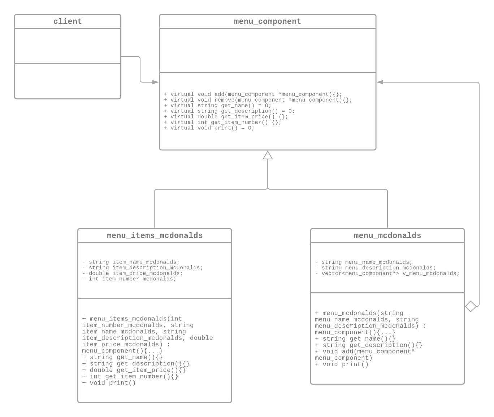

# $PLICE PROJECT
> Authors: [*Xin Wang*](https://github.com/xinwng), [*Jeanette Oh*](https://github.com/jeanetteoh), [*Hongan Zhang*](https://github.com/hongan-z)

## Phase I: Project Description
### Premise
This ```README.md``` file will provide relevant information regarding the design patterns that were utilized and applied within this project; it will also serve as an in-depth insight into the overall implementation of the project. In an attempt to declutter the headers, there is an ```include.hpp``` file that contains all the necessary #include directives.

### Why is this project interesting to us?
SPLICE is a way of simplifying everyday experiences. Our group holds the idea of efficiency and convenience to a high level so we wanted to create an easy to use application that simplifies splitting the check with friends or family. It has always been an inconvenience to split a receipt and compute the intricate mathematics when trying to figure out which person needs to pay what amount. SPLICE attempts in providing a simpler way of denoting what was ordered, by who, and how much they need to pay.  

### What languages/tools/technologies do we plan to use?
This project will be coded in C++. We understand that testing is an integral part of successfully compiling a project, therefore we will be incorporating the standard Google Unit Test Framework (gtest) in pursuance of holding our project in a higher standard of quality. In addition, by completing this project, we strive to learn the importance of teamwork through GitFlow - including branching, resolving merge conflicts, opening pull requests, discussing code, and deploying our project. Adding on, this project will also test through Continuous Integration through Github Actions as we learned in Lab 5. This **[extension](https://github.com/marketplace/actions/actions-setup-cmake)** was utilized to help configure cmake in our ```splice.yml``` file. This file is located in ```.github/workflows/splice.yml```. Note that, cmake will be utilized for compilation.

### What will be the input/output for our project?
The inputs to our project will be the party name, party size, party member names, restaurant selection, and item selections. We will then create a unique cart for each party member which will serve as an intermediate step into our final output, which is the exact amount each consumer needs to pay per their specific carts. 

### What design patterns will we be incorporating?
**1. Prototype**

Incorporating the prototype design pattern within our project would entail creating multiple new types of restaurants that we can clone the template from. It would allow us to create copies of existing objects, and also modify it to our needs. As we are going to include numerous different restaurants, cloning each object would be more efficient and less expensive as opposed to creating new objects. For the purpose of this project, there will be no APIs utilized, and therefore we have decided to only implement 9 fast food restaurants that fall into 3 categories: burgers, pizzas, and tacos. 

**2. Composite**

As the composite design pattern would allow us to treat individual objects in an uniformed manner. We have utilized this pattern for constructing the menu and its menu items, the parties and the party members, and lastly, linking the party members with their respective carts.

##### 2a. Constructing the menu and the menu items for different restaurants
As all ```menu_<restaurant name> (container)``` contain different ```menu_item_<restaurant name> (leaf)```, the ```menu_component (interface)``` will provide common specific operations that will delegate the work to the respective location in the hierarchy. For example, when constructing the menu and its items, the ```menu_component``` should successfully recognize the difference between what is a menu versus what is a menu item in our client. 

```c++
menu_component *mcdonalds_menu_customer_favorites = new menu_mcdonalds("McDonald's Menu, Customer Favorites", "Following Options are the Most Popular Items at McDonald's");
menu_component *big_mac = new menu_items_mcdonalds(1, "Big Mac", "Mouthwatering perfection starts with two 100% pure beef patties and Big Mac sauce sandwiched between a sesame seed bun. It’s topped off with pickles, crisp shredded lettuce, finely chopped onion and American cheese.", 3.99);
```
This should yield the output:
```
Menu Name: McDonald's Menu, Customer Favorites
Menu Description: Following Options are the Most Popular Items at McDonald's

Item Number: 1
Item Name: Big Mac
Item Description: Mouthwatering perfection starts with two 100% pure beef patties and Big Mac sauce sandwiched between a sesame seed bun. It’s topped off with pickles, crisp shredded lettuce, finely chopped onion and American cheese.
Item Price: 3.99
```

##### 2b. Constructing the parties and the party members
> Note that when discussing the ```parties and the party members composite pattern``` the term **party member** is synonymous to the class type ```party_component user```. The term party member is used throughout the ```README.md``` for clarity. 

By utilizing the composite pattern to create the ```party (container)```, and the party members, ```user (leaves)``` - we have constructed a ```party_component (interface)``` that successfully recognizes whether we are creating new parties or new party members. A snippet of how we utilized this portion of the composite pattern within our client is:

```c++
party_component *m_party_1 = new party("Party of 3", 3);
party_component *user_1 = new user("Xin");
party_component *user_2 = new user("Jeanette");
party_component *user_3 = new user("Hongan");
```

By calling ```m_party_1->print()```, the composite pattern should successfully display all of the party details.

```
Party Name: Party of 3
Party Size: 3
User 1: Xin
User 2: Jeanette
User 3: Hongan
```

##### 2c. Constructing the user carts and their respective cart items
We had a bit of a difficulty implementing this class as ```cart_component user_cart``` and ```party_component user``` shared some commonalities of redundancy. However, we were still able to utilize this in the way we originally intended. All ```user_cart (container)``` will take in a ```party_component *``` as a parameter to recognize the user, and each user will have their individual ```cart_items (leaves)``` which takes in a parameter of ```menu_component *``` to recognize the menu items. There is an ```add_to_cart``` function that also takes in a ```menu_component*``` parameter in order to continue adding menu items and building the specific user's cart. The ```cart_component (interface)``` will manage the necessary operations to successfuly delegate work based on the parameter. The purpose of utilizing this composite function is for it to successfully recognize the individuality between different users and output their respective cart items based on the menu items they have selected. This composite pattern also successfuly provides a linkage to the previous two patterns. An example of how it is utilized in our client is:

```c++
menu_component *c_mcdonalds_test = new menu_mcdonalds("McDonalds Test", "\nDescription Test");
menu_component *test_1 = new menu_items_mcdonalds(1, "Test 1", "Description Test 1", 6);
menu_component *test_2 = new menu_items_mcdonalds(2, "Test 2", "Description Test 2", 4.30);
cart_component *cart_xin = new user_cart(user_xin);
cart_component *cart_items_xin = new cart_items(test_1);
cart_items_xin->add_to_cart(test_2);
```

By calling ```cart_xin->display()```, the composite pattern should successfully display all the menu items within this cart, the total price this person needs to pay with and without tax. Note that all taxes are calculated based on the city of Riverside, which is 8.75%.

```
Displaying Xin's Cart
---------------------------------
Item Number: 1
Item Name: Test 1
Item Description: Description Test 1
Item Price: 6

Item Number: 2
Item Name: Test 2
Item Description: Description Test 2
Item Price: 4.3

Price of Test 1 is: $6
Price of Test 2 is: $4.3

Total Cart Price is: $10.3
Total Cart Price (Including Tax): $11.2012
```

## Phase II: OMT Diagrams
#### Restaurant Prototype Pattern


As stated before, the use of this pattern allows for the cloning of different restaurants. This allows for the client to easily copy any object that follows such prototype interface. The "Concrete Prototypes" will be the different categories of Fast Food places such as burgers, pizzas, and tacos. The way it is utilized through is demonstrated below:

> This file can be found in ```prototype/src/fastfood_creator.cpp```.

```c++
FastFood *Create(const string &fastfood_store_name, const string &fastfood_store_price, string_view fastfood_type)
{
    if (fastfood_type == "Burger")
    {
        return new Burger(fastfood_store_name);
    }
    else if (fastfood_type == "Taco")
    {
        return new Taco(fastfood_store_name);
    }
    else if (fastfood_type == "Pizza")
    {
        return new Pizza(fastfood_store_name);
    }
    return nullptr;
}
```
Based on the type of fast food category we want to implement, ```FastFood *Create(...)``` will return a new instance of the selected restaurant. An example of the ```FastFood_Client``` interface is displayed below:
> This file can be found under ```prototype/fastfood_client.cpp```

```c++
...
m_Burger.push_back(Create("McDonald's", "$", "Burger"));
m_Burger.at(0)->set_fastfood_store_price("$");
    
auto ChickFilA = m_Burger[0]->clone();
ChickFilA->set_fastfood_store_name("Chick-Fil-A");
ChickFilA->set_fastfood_store_price("$$");
m_Burger.push_back(ChickFilA);

auto InNOut = m_Burger[0]->clone();
InNOut->set_fastfood_store_name("In-N-Out");
InNOut->set_fastfood_store_price("$");
m_Burger.push_back(InNOut);
```

This would yield an output of:

```
Burger Places
===============
1. Restaurant Name: McDonald's
Restaurant Category: Fast Food
Restaurant Price (from $ to $$$): $

2. Restaurant Name: Chick-Fil-A
Restaurant Category: Fast Food
Restaurant Price (from $ to $$$): $$

3. Restaurant Name: In-N-Out
Restaurant Category: Fast Food
Restaurant Price (from $ to $$$): $
```

As displayed above, the usage of this pattern makes the process of creating new types of restaurants significantly more efficient. As each category: burger, pizzas, and tacos contain a distinctive vector to store its information. Constructing new restaurants is as simple as cloning it from the previous restaurant and then setting the proper name and price for the new restaurant. 
	
#### Composite Patterns

##### Menu & Menu Items Composite Pattern

> The OMT Disgram above only demonstrates one of the many restaurants that utilize the ```menu_component``` base class. All the other restaurants we have chose to implement also comprises of a respective component class and leaf class that replicates a similar OMT diagram. Such files can be found under ```composite/menu_burger/...```, ```composite/menu_pizza/...```, and ```composite/menu_taco/...```

Due to limitations, for each restaurant, we decided to only add around 9-10 of their customer favorite items. These display functions can be found under ```interface/```, an example will be displayed below:

```c++
class menu_mcdonalds_display
{
public:
    void display_mcdonalds_customer_favorites()
    {
        menu_component *mcdonalds_menu_customer_favorites = new menu_mcdonalds("McDonald's Menu, Customer Favorites", "Following Options are the Most Popular Items at McDonald's");
        // BIG MAC
        menu_component *big_mac = new menu_items_mcdonalds(1, "Big Mac", "Mouthwatering perfection starts with two 100% pure beef patties and Big Mac sauce sandwiched between a sesame seed bun. It’s topped off with pickles, crisp shredded lettuce, finely chopped onion and American cheese.", 3.99);
        // MCNUGGETS 4 PIECE
        menu_component *mcnuggets_4_piece = new menu_items_mcdonalds(2, "McNuggets 4 Piece", "Our tender, juicy Chicken McNuggets® are made with 100% white meat chicken and no artificial colors, flavors or preservatives.", 1.99);
        menu_component *mcnuggets_10_piece = new menu_items_mcdonalds(3, "McNuggets 10 Piece", "Our tender, juicy Chicken McNuggets® are made with 100% white meat chicken and no artificial colors, flavors or preservatives.", 4.49);
        // ICED COFFEE
        menu_component *iced_coffee_small = new menu_items_mcdonalds(4, "Iced Coffee (Small)", "McCafe Iced Coffee is refreshingly cool and made with 100% Arabica beans, cream and your choice of flavored coffee syrup – caramel, hazelnut, French vanilla and sugar-free French vanilla.", 1.39);
        menu_component *iced_coffee_medium = new menu_items_mcdonalds(5, "Iced Coffee (Medium)", "McCafe Iced Coffee is refreshingly cool and made with 100% Arabica beans, cream and your choice of flavored coffee syrup – caramel, hazelnut, French vanilla and sugar - free French vanilla.", 1.79);
        menu_component *iced_coffee_large = new menu_items_mcdonalds(6, "Iced Coffee (Large)", "McCafe Iced Coffee is refreshingly cool and made with 100% Arabica beans, cream and your choice of flavored coffee syrup – caramel, hazelnut, French vanilla and sugar - free French vanilla.", 1.99);
        //FRIES
        menu_component *fries_small = new menu_items_mcdonalds(7, "Fries Small", "Our World Famous Fries® are made with premium potatoes such as the Russet Burbank and the Shepody. With 0g of trans fat per labeled serving, these epic fries are crispy and golden on the outside and fluffy on the inside.", 1.39);
        menu_component *fries_medium = new menu_items_mcdonalds(8, "Fries Medium", "Our World Famous Fries® are made with premium potatoes such as the Russet Burbank and the Shepody. With 0g of trans fat per labeled serving, these epic fries are crispy and golden on the outside and fluffy on the inside.", 1.79);
        menu_component *fries_large = new menu_items_mcdonalds(9, "Fries Large", "Our World Famous Fries® are made with premium potatoes such as the Russet Burbank and the Shepody. With 0g of trans fat per labeled serving, these epic fries are crispy and golden on the outside and fluffy on the inside.", 1.89);

        mcdonalds_menu_customer_favorites->add(big_mac);

        mcdonalds_menu_customer_favorites->add(mcnuggets_4_piece);
        mcdonalds_menu_customer_favorites->add(mcnuggets_10_piece);

        mcdonalds_menu_customer_favorites->add(iced_coffee_small);
        mcdonalds_menu_customer_favorites->add(iced_coffee_medium);
        mcdonalds_menu_customer_favorites->add(iced_coffee_large);

        mcdonalds_menu_customer_favorites->add(fries_small);
        mcdonalds_menu_customer_favorites->add(fries_medium);
        mcdonalds_menu_customer_favorites->add(fries_large);

        mcdonalds_menu_customer_favorites->print();
    }
};
```

This is then utilized within our ```main.cpp``` (command line executable) from instantiating a menu_mcdonalds_display object ```menu_mcdonalds_display i_mcdonalds``` and calling the display interface```i_mcdonalds.display_mcdonalds_customer_favorites``` as shown below:

```c++
string display_burger_places()
{
    ...
    cout << "Choose a selection from the above restaurants!" << endl;

    int choice = 0;
    cin >> choice;
    int burger_choice = 0;
    string restaurant_name = "";
    if (choice == 1)
    {
        menu_mcdonalds_display i_mcdonalds;
        i_mcdonalds.display_mcdonalds_customer_favorites();
        restaurant_name = "McDonalds";
        return restaurant_name;
    }
    ...
```

Again, this would yield the output: 

```
Menu Name: McDonald's Menu, Customer Favorites
Menu Description: Following Options are the Most Popular Items at McDonald's

Item Number: 1
Item Name: Big Mac
Item Description: Mouthwatering perfection starts with two 100% pure beef patties and Big Mac sauce sandwiched between a sesame seed bun. It’s topped off with pickles, crisp shredded lettuce, finely chopped onion and American cheese.
Item Price: 3.99

Item Number: 2
Item Name: McNuggets 4 Piece
Item Description: Our tender, juicy Chicken McNuggets® are made with 100% white meat chicken and no artificial colors, flavors or preservatives.
Item Price: 1.99

Item Number: 3
Item Name: McNuggets 10 Piece
Item Description: Our tender, juicy Chicken McNuggets® are made with 100% white meat chicken and no artificial colors, flavors or preservatives.
Item Price: 4.49

Item Number: 4
Item Name: Iced Coffee (Small)
Item Description: McCafe Iced Coffee is refreshingly cool and made with 100% Arabica beans, cream and your choice of flavored coffee syrup – caramel, hazelnut, French vanilla and sugar-free French vanilla.
Item Price: 1.39

Item Number: 5
Item Name: Iced Coffee (Medium)
Item Description: McCafe Iced Coffee is refreshingly cool and made with 100% Arabica beans, cream and your choice of flavored coffee syrup – caramel, hazelnut, French vanilla and sugar - free French vanilla.
Item Price: 1.79

Item Number: 6
Item Name: Iced Coffee (Large)
Item Description: McCafe Iced Coffee is refreshingly cool and made with 100% Arabica beans, cream and your choice of flavored coffee syrup – caramel, hazelnut, French vanilla and sugar - free French vanilla.
Item Price: 1.99

Item Number: 7
Item Name: Fries Small
Item Description: Our World Famous Fries® are made with premium potatoes such as the Russet Burbank and the Shepody. With 0g of trans fat per labeled serving, these epic fries are crispy and golden on the outside and fluffy on the inside.
Item Price: 1.39

Item Number: 8
Item Name: Fries Medium
Item Description: Our World Famous Fries® are made with premium potatoes such as the Russet Burbank and the Shepody. With 0g of trans fat per labeled serving, these epic fries are crispy and golden on the outside and fluffy on the inside.
Item Price: 1.79

Item Number: 9
Item Name: Fries Large
Item Description: Our World Famous Fries® are made with premium potatoes such as the Russet Burbank and the Shepody. With 0g of trans fat per labeled serving, these epic fries are crispy and golden on the outside and fluffy on the inside.
Item Price: 1.89
```

##### Party & Party Members (User) Composite Pattern


In addition to the usage shown in Phase 2/2b., another example of utilizing the party and party member composite pattern in our ```main.cpp``` would be the initial asking for a party name and their size. Depending on the size, we will instantiate a corresponding number of user carts. Note that the ```party_component *i_user1``` works hand in hand with ```cart_component *i_user1_cart```.

```c++
...
    cout << "Give your party a name! Press 'Enter' when you are done!" << endl;
    cin >> i_party_name;
    party_component *i_party = new party(i_party_name, i_party_size);
	
    ...
    
    cout << "How many people are in your party? We can only support up to 3 people." << endl;
    cin >> i_party_size;
    
    party_component *i_user1 = new user(user1);
        if(i_party_size == 1)
        {
            party_component *i_user1 = new user(user1);
            cart_component *i_user1_cart = new user_cart(i_user1);
	    ...
```


##### User Cart & Cart Items Composite Pattern

> At this moment, we only support up to 3 users.

If there is only 1 user, we will only instantiate 1 ```user_cart``` and 1 ```cart_items``` to store all of the menu items they selected.

An example is shown below from ```main.cpp```:

```c++
...
if(i_party_size == 1)
{
    party_component *i_user1 = new user(user1);
    cart_component *i_user1_cart = new user_cart(i_user1);
    cout << "For " << user1 << ", what would you like to add to their cart?" << endl;
    cout << "Please enter the item number from the restaurant you have selected." << endl;
    cout << "After all items have been added, press '0'." << endl;

    cin >> mcdonalds_item_number;
    cart_component *i_user1_cart_items = new cart_items(i_mcdonalds_cart.at(mcdonalds_item_number - 1));

    bool mcdonalds_condition = true;
    while (mcdonalds_condition)
    {
        cin >> mcdonalds_item_number_1;
        if (mcdonalds_item_number_1 == 0)
        {
            mcdonalds_item_number_1 = false;
            break;
        }
        i_user1_cart_items->add_to_cart(i_mcdonalds_cart.at(mcdonalds_item_number_1 - 1));
    }
    i_user1_cart->add(i_user1_cart_items);
    i_user1_cart->display();
}
```
> This process will repeat depending on the number of users. 

To demonstrate the purpose of this code, let's envision a real scenario. Let's say a user, Xin, ate at McDonald's and he had a *McNuggets 10 Piece*, *Iced Coffee (Large)*, and a *Big Mac*, ```i_user1_cart``` will store all of those inputs by identifying the ```item_number``` variable in ```menu_component``` and ```i_user1_cart->display()``` will then yield an output of:

```
For Xin, what would you like to add to their cart?
Please enter the item number from the restaurant you have selected.
After all items have been added, press '0'.

Displaying Xin's Cart
---------------------------------
Item Number: 6
Item Name: Iced Coffee (Large)
Item Description: McCafe Iced Coffee is refreshingly cool and made with 100% Arabica beans, cream and your choice of flavored coffee syrup – caramel, hazelnut, French vanilla and sugar - free French vanilla.
Item Price: 1.99

Item Number: 3
Item Name: McNuggets 10 Piece
Item Description: Our tender, juicy Chicken McNuggets® are made with 100% white meat chicken and no artificial colors, flavors or preservatives.
Item Price: 4.49

Item Number: 1
Item Name: Big Mac
Item Description: Mouthwatering perfection starts with two 100% pure beef patties and Big Mac sauce sandwiched between a sesame seed bun. It’s topped off with pickles, crisp shredded lettuce, finely chopped onion and American cheese.
Item Price: 3.99

Price of Iced Coffee (Large) is: $1.99
Price of McNuggets 10 Piece is: $4.49
Price of Big Mac is: $3.99

Total Cart Price is: $10.47
Total Cart Price (Including Tax): $11.3861
```
> The input for to receive this result was ```"input_any_party_name", 1, Xin, 1, 1, 6, 3, 1, 0``` in ```main.cpp```
	
## Phase III: Development, Testing, and Scrum Meeting
###### Scrum Meeting with Philip Park - Monday, November 23 (11:00am - 2:00pm)
All unit test cases abide by the [**Google Test Framework**](https://github.com/google/googletest). All test executables are run on our local machines for testing and then through Continuous Integration from GitHub Actions through our ```splice.yml``` file located in ```.github/workflows/splice.yml```. Print statements were utilized to display the output of a function call before ```main.cpp``` was created.

### Testing Restaurant Prototype Pattern
Here is our unit test cases for our ```restaurant``` prototype pattern. This file can be found in ```prototype/tests/fastfood_tests.hpp```.

Some unit test cases include:

```c++
TEST(FastFood_Tests, SizeTest)
{
    vector<FastFood *> m_sizeTest;
    m_sizeTest.push_back(new Pizza("Domino's Pizza"));
    m_sizeTest.push_back(new Taco("Taco Bell"));
    m_sizeTest.push_back(new Burger("McDonald's"));
    ASSERT_EQ(m_sizeTest.size(), 3);
}

TEST(FastFood_Tests, StringTest)
{
    vector<FastFood *> m_stringTest;
    m_stringTest.push_back(new Pizza("Domino's Pizza"));
    m_stringTest.push_back(new Taco("Taco Bell"));
    m_stringTest.push_back(new Burger("McDonald's"));
    for (auto FastFood : m_stringTest)
    {
        EXPECT_EQ(m_stringTest.at(0)->get_fastfood_store_name(), "Domino's Pizza");
        EXPECT_EQ(m_stringTest.at(1)->get_fastfood_store_name(), "Taco Bell");
        EXPECT_EQ(m_stringTest.at(2)->get_fastfood_store_name(), "McDonald's");
    }
}

TEST(FastFood_Tests, Clone_McDonalds_FiveGuys)
{
    vector<FastFood *> m_Burgers;
    m_Burgers.push_back(new Burger("McDonald's")); //Clone this

    cout << "Cloning from -> " << m_Burgers.at(0)->get_fastfood_store_name() << endl;
    m_Burgers.at(0)->set_fastfood_store_price("$");
    
    auto FastFood = m_Burgers[0]->clone();
    FastFood->set_fastfood_store_name("Five Guys");
    FastFood->set_fastfood_store_price("$$");
    m_Burgers.push_back(FastFood);
    
    cout << "Cloned object is: " << m_Burgers.at(1)->get_fastfood_store_name() << endl;
    cout << endl;
    
    for(auto FastFood: m_Burgers)
    {
        FastFood->fastfood_display_store_info();
    }

    EXPECT_EQ(m_Burgers.at(0)->get_fastfood_store_name(), "McDonald's");
    EXPECT_EQ(m_Burgers.at(1)->get_fastfood_store_name(), "Five Guys");
}

```
These 3 tests would yield the results:

```
[ RUN      ] FastFood_Tests.SizeTest
[       OK ] FastFood_Tests.SizeTest (0 ms)
[ RUN      ] FastFood_Tests.StringTest
[       OK ] FastFood_Tests.StringTest (0 ms)
[ RUN      ] FastFood_Tests.Clone_McDonalds_FiveGuys
Cloning from -> McDonald's
Cloned object is: Five Guys

Restaurant Name: McDonald's
Restaurant Category: Fast Food
Restaurant Price (from $ to $$$): $

Restaurant Name: Five Guys
Restaurant Category: Fast Food
Restaurant Price (from $ to $$$): $$

[       OK ] FastFood_Tests.Clone_McDonalds_FiveGuys (0 ms)
```

### Testing Menu & Menu Items Composite Pattern
As mentioned before, our ```menu``` component classes and ```menu_items``` leaf classes are separated by the different restaurants. 

> The following burger classes: ```menu_mcdonalds.hpp```, ```menu_items_mcdonalds.hpp```,```menu_chickfila.hpp```, ```menu_items_chickfila.hpp```, ```menu_innout.hpp```, ```menu_items_innout.hpp``` all derive from the base interface class ```menu_component.hpp```; these files can be found under ```composite/menu_burger/header/```. 

> The following pizza classes: ```menu_dominos.hpp```, ```menu_items_dominos.hpp```, ```menu_papajohns.hpp```, ```menu_items_papajohns.hpp```, ```menu_pizzahut.hpp```, ```menu_items_pizzahut.hpp``` also derive from the base interface class ```menu_component.hpp```; these files can be found under ```composite/menu_pizza/header/```. 

> The following taco classes: ```menu_tacobell.hpp```, ```menu_items_tacobell.hpp```, ```menu_deltaco.hpp```, ```menu_items_deltaco.hpp```, ```menu_elpolloloco.hpp```, ```menu_items_elpolloloco.hpp```also derive from the base interface class ```menu_component.hpp```; these files can be found under ```composite/menu_taco/header/```. 

> The test cases for each class can be found within their respective directories under ```composite/menu_<restaurant_category>/tests/```

For the purpose of condensing the ```README.md``` file, we will only display unit test cases for ```menu_mcdonalds``` and ```menu_items_mcdonalds```, since both of these files belong to ```menu_burger```, its test files can be found under ```composite/menu_burger/tests/```.

Some unit test cases for ```menu_mcdonalds``` and ```menu_item_mcdonalds``` include:

```c++
TEST(MenuTest, McDonalds_CustomerFavorites)
{
    menu_component *m_mcdonalds_customer_favorites = new menu_mcdonalds("Customer Favorites", "Following Options are the Most Popular Items at McDonald's");

     EXPECT_EQ(m_mcdonalds_customer_favorites->get_name(), "Customer Favorites");
     EXPECT_EQ(m_mcdonalds_customer_favorites->get_description(), "Following Options are the Most Popular Items at McDonald's");

    menu_component *big_mac = new menu_items_mcdonalds(1, "Big Mac", "Mouthwatering perfection starts with two 100% pure beef patties and Big Mac sauce sandwiched between a sesame seed bun. It’s topped off with pickles, crisp shredded lettuce, finely chopped onion and American cheese.", 3.99);
     m_mcdonalds_customer_favorites->add(big_mac);
     cout << "EXPECTED ITEM NUMBER: 1"
          << "\nRECEIVIED: " << big_mac->get_item_number() << endl;
     EXPECT_EQ(big_mac->get_item_number(), 1);


    menu_component *mcnuggets_4_piece = new menu_items_mcdonalds(2, "4 Piece Chicken McNuggets", "Our tender, juicy Chicken McNuggets® are made with 100% white meat chicken and no artificial colors, flavors or preservatives.", 1.99);
     m_mcdonalds_customer_favorites->add(mcnuggets_4_piece);
     cout << "EXPECTED ITEM NUMBER: 2"
          << "\nRECEIVIED: " << mcnuggets_4_piece->get_item_number() << endl;
     EXPECT_EQ(mcnuggets_4_piece->get_item_number(), 2);


     menu_component *mcnuggets_10_piece = new menu_items_mcdonalds(3, "10 Piece Chicken McNuggets", "Our tender, juicy Chicken McNuggets® are made with 100% white meat chicken and no artificial colors, flavors or preservatives.", 4.49);
     m_mcdonalds_customer_favorites->add(mcnuggets_10_piece);
     cout << "EXPECTED ITEM NUMBER: 3"
          << "\nRECEIVIED: " << mcnuggets_10_piece->get_item_number() << endl;   
     EXPECT_EQ(mcnuggets_10_piece->get_item_number(), 3);


     menu_component *iced_coffee_small = new menu_items_mcdonalds(4, "Iced Coffee (Small)", "McCafe Iced Coffee is refreshingly cool and made with 100% Arabica beans, cream and your choice of flavored coffee syrup – caramel, hazelnut, French vanilla and sugar-free French vanilla.", 1.39);
     m_mcdonalds_customer_favorites->add(iced_coffee_small);
     cout << "EXPECTED ITEM NUMBER: 4"
          << "\nRECEIVIED: " << iced_coffee_small->get_item_number() << endl;   
     EXPECT_EQ(iced_coffee_small->get_item_number(), 4);


     menu_component *iced_coffee_medium = new menu_items_mcdonalds(5, "Iced Coffee (Medium)", "McCafe Iced Coffee is refreshingly cool and made with 100% Arabica beans, cream and your choice of flavored coffee syrup – caramel, hazelnut, French vanilla and sugar - free French vanilla.", 1.79);
     m_mcdonalds_customer_favorites->add(iced_coffee_medium);
     cout << "EXPECTED ITEM NUMBER: 5"
          << "\nRECEIVIED: " << iced_coffee_medium->get_item_number() << endl;   
     EXPECT_EQ(iced_coffee_medium->get_item_number(), 5);


     menu_component *iced_coffee_large = new menu_items_mcdonalds(6, "Iced Coffee (Large)", "McCafe Iced Coffee is refreshingly cool and made with 100% Arabica beans, cream and your choice of flavored coffee syrup – caramel, hazelnut, French vanilla and sugar - free French vanilla.", 1.99);
     m_mcdonalds_customer_favorites->add(iced_coffee_large);
     cout << "EXPECTED ITEM NUMBER: 6"
          << "\nRECEIVIED: " << iced_coffee_large->get_item_number() << endl;   
     EXPECT_EQ(iced_coffee_large->get_item_number(), 6);


     menu_component *fries_small = new menu_items_mcdonalds(7, "Fries Small", "Our World Famous Fries® are made with premium potatoes such as the Russet Burbank and the Shepody. With 0g of trans fat per labeled serving, these epic fries are crispy and golden on the outside and fluffy on the inside.", 1.39);
     m_mcdonalds_customer_favorites->add(fries_small);
     cout << "EXPECTED ITEM NUMBER: 7"
          << "\nRECEIVIED: " << fries_small->get_item_number() << endl;   
     EXPECT_EQ(fries_small->get_item_number(), 7);


     menu_component *fries_medium = new menu_items_mcdonalds(8, "Fries Medium", "Our World Famous Fries® are made with premium potatoes such as the Russet Burbank and the Shepody. With 0g of trans fat per labeled serving, these epic fries are crispy and golden on the outside and fluffy on the inside.", 1.79);
     m_mcdonalds_customer_favorites->add(fries_medium);
     cout << "EXPECTED ITEM NUMBER: 8"
          << "\nRECEIVIED: " << fries_medium->get_item_number() << endl;   
     EXPECT_EQ(fries_medium->get_item_number(), 8);


     menu_component *fries_large = new menu_items_mcdonalds(9, "Fries Large", "Our World Famous Fries® are made with premium potatoes such as the Russet Burbank and the Shepody. With 0g of trans fat per labeled serving, these epic fries are crispy and golden on the outside and fluffy on the inside.", 1.89);
     m_mcdonalds_customer_favorites->add(fries_large);
     cout << "EXPECTED ITEM NUMBER: 9"
          << "\nRECEIVIED: " << fries_large->get_item_number() << endl;   
     EXPECT_EQ(fries_large->get_item_number(), 9);
     m_mcdonalds_customer_favorites->print();
}
```

This test would yield the following result:

```
[==========] Running 3 tests from 1 test suite.
[----------] Global test environment set-up.
[----------] 3 tests from MenuTest
[ RUN      ] MenuTest.McDonalds_CustomerFavorites
EXPECTED ITEM NUMBER: 1
RECEIVIED: 1
EXPECTED ITEM NUMBER: 2
RECEIVIED: 2
EXPECTED ITEM NUMBER: 3
RECEIVIED: 3
EXPECTED ITEM NUMBER: 4
RECEIVIED: 4
EXPECTED ITEM NUMBER: 5
RECEIVIED: 5
EXPECTED ITEM NUMBER: 6
RECEIVIED: 6
EXPECTED ITEM NUMBER: 7
RECEIVIED: 7
EXPECTED ITEM NUMBER: 8
RECEIVIED: 8
EXPECTED ITEM NUMBER: 9
RECEIVIED: 9

Menu Name: Customer Favorites
Menu Description: Following Options are the Most Popular Items at McDonald's

Item Number: 1
Item Name: Big Mac
Item Description: Mouthwatering perfection starts with two 100% pure beef patties and Big Mac sauce sandwiched between a sesame seed bun. It’s topped off with pickles, crisp shredded lettuce, finely chopped onion and American cheese.
Item Price: 3.99

Item Number: 2
Item Name: 4 Piece Chicken McNuggets
Item Description: Our tender, juicy Chicken McNuggets® are made with 100% white meat chicken and no artificial colors, flavors or preservatives.
Item Price: 1.99

Item Number: 3
Item Name: 10 Piece Chicken McNuggets
Item Description: Our tender, juicy Chicken McNuggets® are made with 100% white meat chicken and no artificial colors, flavors or preservatives.
Item Price: 4.49

Item Number: 4
Item Name: Iced Coffee (Small)
Item Description: McCafe Iced Coffee is refreshingly cool and made with 100% Arabica beans, cream and your choice of flavored coffee syrup – caramel, hazelnut, French vanilla and sugar-free French vanilla.
Item Price: 1.39

Item Number: 5
Item Name: Iced Coffee (Medium)
Item Description: McCafe Iced Coffee is refreshingly cool and made with 100% Arabica beans, cream and your choice of flavored coffee syrup – caramel, hazelnut, French vanilla and sugar - free French vanilla.
Item Price: 1.79

Item Number: 6
Item Name: Iced Coffee (Large)
Item Description: McCafe Iced Coffee is refreshingly cool and made with 100% Arabica beans, cream and your choice of flavored coffee syrup – caramel, hazelnut, French vanilla and sugar - free French vanilla.
Item Price: 1.99

Item Number: 7
Item Name: Fries Small
Item Description: Our World Famous Fries® are made with premium potatoes such as the Russet Burbank and the Shepody. With 0g of trans fat per labeled serving, these epic fries are crispy and golden on the outside and fluffy on the inside.
Item Price: 1.39

Item Number: 8
Item Name: Fries Medium
Item Description: Our World Famous Fries® are made with premium potatoes such as the Russet Burbank and the Shepody. With 0g of trans fat per labeled serving, these epic fries are crispy and golden on the outside and fluffy on the inside.
Item Price: 1.79

Item Number: 9
Item Name: Fries Large
Item Description: Our World Famous Fries® are made with premium potatoes such as the Russet Burbank and the Shepody. With 0g of trans fat per labeled serving, these epic fries are crispy and golden on the outside and fluffy on the inside.
Item Price: 1.89

[       OK ] MenuTest.McDonalds_CustomerFavorites (1 ms)
```

### Testing Party & Party Members Composite Pattern
Here is our unit test cases for our ```party``` and```user``` composite pattern. This file can be found in ```composite/party_tests/party_test.hpp```.

Some unit test cases include:

```c++
TEST(Party_Test, Create_Party)
{
    party_component *m_party_1 = new party("Party of 3", 3);
    cout << "EXPECTED PARTY NAME: Party of 3" << '\n'
         << "RECEIVED PARTY NAME: " << m_party_1->get_name() << endl;
    EXPECT_EQ(m_party_1->get_name(), "Party of 3");

    cout << endl;

    cout << "EXPECTED PARTY SIZE: 3" << '\n'
         << "RECEIVED PARTY SIZE: " << m_party_1->get_size() << endl;
    EXPECT_EQ(m_party_1->get_size(), 3);

    m_party_1->print();
}

TEST(Party_Test, Create_Parties)
{
    party_component *m_party_1 = new party("Party of 3", 3);
    cout << "EXPECTED PARTY NAME: Party of 3" << '\n'
         << "RECEIVED PARTY NAME: " << m_party_1->get_name() << endl;
    EXPECT_EQ(m_party_1->get_name(), "Party of 3");

    cout << endl;

    cout << "EXPECTED PARTY SIZE: 3" << '\n'
         << "RECEIVED PARTY SIZE: " << m_party_1->get_size() << endl;
    EXPECT_EQ(m_party_1->get_size(), 3);

    party_component *m_party_2 = new party("Party of 8", 8);
    cout << "EXPECTED PARTY NAME: Party of 8" << '\n'
         << "RECEIVED PARTY NAME: " << m_party_2->get_name() << endl;
    EXPECT_EQ(m_party_2->get_name(), "Party of 8");

    cout << endl;

    cout << "EXPECTED PARTY SIZE: 8" << '\n'
         << "RECEIVED PARTY SIZE: " << m_party_2->get_size() << endl;
    EXPECT_EQ(m_party_2->get_size(), 8);
    m_party_2->print();
}

TEST(Party_Test, Remover_User_1)
{
    party_component *m_party_1 = new party("Party of 3", 3);
    EXPECT_EQ(m_party_1->get_name(), "Party of 3");
    EXPECT_EQ(m_party_1->get_size(), 3);
    cout << endl;
    m_party_1->print();

    cout << endl;
    party_component *user_1 = new user("Xin");
    m_party_1->add(user_1);
    cout << "EXPECTED USER NAME: " << user_1->get_name() << endl;
    EXPECT_EQ(user_1->get_name(), "Xin");
    user_1->print();

    cout << endl;
    party_component *user_2 = new user("Jeanette");
    m_party_1->add(user_2);
    cout << "EXPECTED USER NAME: " << user_2->get_name() << endl;
    EXPECT_EQ(user_2->get_name(), "Jeanette");
    user_2->print();

    cout << endl;
    party_component *user_3 = new user("Hongan");
    m_party_1->add(user_3);
    cout << "EXPECTED USER NAME: " << user_3->get_name() << endl;
    EXPECT_EQ(user_3->get_name(), "Hongan");
    user_3->print();

    cout << endl
         << endl;

    cout << "BEFORE REMOVE: " << endl;

    m_party_1->print();

    m_party_1->remove(user_1);

    cout << endl;

    cout << "AFTER REMOVE: " << endl;
    m_party_1->print();
}
```

These 3 tests would yield the results:

```
[ RUN      ] Party_Test.Create_Party
EXPECTED PARTY NAME: Party of 3
RECEIVED PARTY NAME: Party of 3

EXPECTED PARTY SIZE: 3
RECEIVED PARTY SIZE: 3
Party Name: Party of 3
Party Size: 3
[       OK ] Party_Test.Create_Party (0 ms)
```
```
[ RUN      ] Party_Test.Create_Parties
EXPECTED PARTY NAME: Party of 3
RECEIVED PARTY NAME: Party of 3

EXPECTED PARTY SIZE: 3
RECEIVED PARTY SIZE: 3
EXPECTED PARTY NAME: Party of 8
RECEIVED PARTY NAME: Party of 8

EXPECTED PARTY SIZE: 8
RECEIVED PARTY SIZE: 8
Party Name: Party of 8
Party Size: 8
[       OK ] Party_Test.Create_Parties (0 ms)
```
```
[ RUN      ] Party_Test.Remover_User_1

Party Name: Party of 3
Party Size: 3

EXPECTED USER NAME: Xin
Xin
EXPECTED USER NAME: Jeanette
Jeanette
EXPECTED USER NAME: Hongan
Hongan

BEFORE REMOVE: 
Party Name: Party of 3
Party Size: 3
User 1: Xin
User 2: Jeanette
User 3: Hongan

AFTER REMOVE: 
Party Name: Party of 3
Party Size: 3
User 1: Jeanette
User 2: Hongan
[       OK ] Party_Test.Remover_User_1 (0 ms)
```

### Testing User Cart & Cart Items Composite Pattern
Here is our unit test cases for our ```user_cart``` and ```cart_items``` composite pattern. This file can be found in ```composite/cart/test/cart_test.hpp```.

Some unit test cases include:

```c++ 
TEST(Cart_Test, Total_Price_Test)
{
    party_component *c_p = new party("Party1", 2);
    party_component *c_user_xin = new user("Xin");
    party_component *c_user_jeanette = new user("Jeanette");

    c_p->add(c_user_xin);
    c_p->add(c_user_jeanette);

    menu_component *c_mcdonalds_test = new menu_mcdonalds("McDonalds Test", "\nDescription Test");
    menu_component *test_1 = new menu_items_mcdonalds(1, "Test 1", "Description Test 1", 1200);
    c_mcdonalds_test->add(test_1);
    menu_component *test_2 = new menu_items_mcdonalds(2, "Test 2", "Description Test 2", 732.84);

    cart_component *c_user_xin_cart_1 = new user_cart(c_user_xin);
    cart_component *xin_cart_items_1 = new cart_items(test_1);
    xin_cart_items_1->add_to_cart(test_2);
    
    c_user_xin_cart_1->add(xin_cart_items_1);

    cout << endl
         << endl;
    cout << "EXPECTED TOTAL PRICE: $ 1932.84, RECEIVED TOTAL PRICE: " << xin_cart_items_1->cart_price() << endl
         << endl;

    c_user_xin_cart_1->display();
    double m_absolute_error = 0.001;
    EXPECT_NEAR(xin_cart_items_1->cart_price(), 1932.84, m_absolute_error);
}

TEST(Cart_Test, Adding_Items_To_Multiple_Carts)
{
     party_component *party_jeanette_xin = new party("Jeanette and Xin", 2);
     party_component *user_xin = new user("Xin");
     party_component *user_jeanette = new user("Jeanette");

     party_jeanette_xin->add(user_xin);
     party_jeanette_xin->add(user_jeanette);
     party_jeanette_xin->print();

     menu_component *c_mcdonalds_test = new menu_mcdonalds("McDonalds Test", "\nDescription Test");
     menu_component *test_1 = new menu_items_mcdonalds(1, "Test 1", "Description Test 1", 6);
     menu_component *test_2 = new menu_items_mcdonalds(2, "Test 2", "Description Test 2", 4.30);
     menu_component *test_3 = new menu_items_mcdonalds(3, "Test 3", "Description Test 3", 2.5);

     cart_component *cart_xin = new user_cart(user_xin);
     cart_component *cart_jeanette = new user_cart(user_jeanette);

     cart_component *cart_items_xin = new cart_items(test_1);
     cart_items_xin->add_to_cart(test_3);
     
     cart_component *cart_items_jeanette = new cart_items(test_2);
     cart_items_jeanette->add_to_cart(test_2);
     cart_items_jeanette->add_to_cart(test_3);

     cart_xin->add(cart_items_xin);
     cart_jeanette->add(cart_items_jeanette);

     cart_xin->display();
     cout << endl
          << endl;
     cart_jeanette->display();


     EXPECT_EQ(cart_items_xin->get_size(), 2);
     EXPECT_EQ(cart_items_jeanette->get_size(), 3);
     double m_absolute_error = 0.001; // 0.1% absolute error allowed for doubles
     EXPECT_NEAR(cart_items_xin->cart_price(), 8.5, m_absolute_error);
     EXPECT_NEAR(cart_items_jeanette->cart_price(), 11.1, m_absolute_error);
}
```

These 2 tests would yield the results:

```
[ RUN      ] Cart_Test.Total_Price_Test


EXPECTED TOTAL PRICE: $ 1932.84, RECEIVED TOTAL PRICE: 1932.84

Displaying Xin's Cart
---------------------------------
Item Number: 1
Item Name: Test 1
Item Description: Description Test 1
Item Price: 1200

Item Number: 2
Item Name: Test 2
Item Description: Description Test 2
Item Price: 732.84

Price of Test 1 is: $1200
Price of Test 2 is: $732.84

Total Cart Price is: $1932.84
Total Cart Price (Including Tax): $2101.96
[       OK ] Cart_Test.Total_Price_Test (1 ms)
```

```
[ RUN      ] Cart_Test.Adding_Items_To_Multiple_Carts
Party Name: Jeanette and Xin
Party Size: 2
User 1: Xin
User 2: Jeanette
Displaying Xin's Cart
---------------------------------
Item Number: 1
Item Name: Test 1
Item Description: Description Test 1
Item Price: 6

Item Number: 3
Item Name: Test 3
Item Description: Description Test 3
Item Price: 2.5

Price of Test 1 is: $6
Price of Test 3 is: $2.5

Total Cart Price is: $8.5
Total Cart Price (Including Tax): $9.24375


Displaying Jeanette's Cart
---------------------------------
Item Number: 2
Item Name: Test 2
Item Description: Description Test 2
Item Price: 4.3

Item Number: 2
Item Name: Test 2
Item Description: Description Test 2
Item Price: 4.3

Item Number: 3
Item Name: Test 3
Item Description: Description Test 3
Item Price: 2.5

Price of Test 2 is: $4.3
Price of Test 2 is: $4.3
Price of Test 3 is: $2.5

Total Cart Price is: $11.1
Total Cart Price (Including Tax): $12.0712
[       OK ] Cart_Test.Adding_Items_To_Multiple_Carts (0 ms)
```

### Testing Strategy Pattern

## Inputs, Outputs, and Screenshots
When ```main.cpp``` is executed, the input: ```CS100, 2, John, Pluto, 1, 3, 1, 5, 4, 0, 2, 3, 0``` triggers the following prompts:

```
Hello! Welcome to SPLICE. Remember, you can press 'q' at anytime to quit!
Give your party a name! Press 'Enter' when you are done!
CS100
How many people are in your party? We can only support up to 3 people.
2
Give User #1 a name!
John 
Give User 2 a name!
Pluto

Did your party eat at...
1. Burger Places
2. Taco Places
3. Pizza Places
1

Burger Places
===============
1. Restaurant Name: McDonald's
Restaurant Category: Fast Food
Restaurant Price (from $ to $$$): $

2. Restaurant Name: Chick-Fil-A
Restaurant Category: Fast Food
Restaurant Price (from $ to $$$): $$

3. Restaurant Name: In-N-Out
Restaurant Category: Fast Food
Restaurant Price (from $ to $$$): $


Choose a selection from the above restaurants!
3

Menu Name: In-N-Out's Menu, Customer Favorites
Menu Description: Following Options are the Most Popular Items at In-N-Out

Item Number: 1
Item Name: Double Double
Item Description: Two 100% pure beef patties, hand lettuce, tomato, spread, two slices of american cheese, with or without onions, stacked high on a freshly baked bun.
Item Price: 3.45

Item Number: 2
Item Name: Cheeseburger
Item Description: 100% Pure beef patty, lettuce, tomato, spread, one slice of american cheese, with or without onions, on a freshly baked bun.
Item Price: 2.4

Item Number: 3
Item Name: Hamburger
Item Description: 100% Pure patty, lettuce, tomato, spread, with or without onions, on a freshly baked bun.
Item Price: 2.1

Item Number: 4
Item Name: French Fries
Item Description: Fresh cut potatoes prepared in 100% vegetable oil.
Item Price: 1.6

Item Number: 5
Item Name: Strawberry Shake
Item Description: Strawberry Shake made with 100% real ice cream.
Item Price: 2.15

Item Number: 6
Item Name: Chocolate Shake
Item Description: Chocolate Shake made with 100% real ice cream.
Item Price: 2.15

Item Number: 7
Item Name: Vanilla Shake
Item Description: Vanilla Shake made with 100% real ice cream.
Item Price: 2.15

Item Number: 8
Item Name: Coffee
Item Description: Hot Brewed Coffee
Item Price: 1.35

Item Number: 9
Item Name: Milk
Item Description: Refreshing Milk
Item Price: 0.99

Item Number: 10
Item Name: Soft Drink (Medium)
Item Description: Refreshing selctions include Coca-Cola, Diet Coke, 7UP, Dr. Pepper, Root Beer, Lemonade, Minute Maid Light Lemonade, and Iced Tea 
Item Price: 1.65

For John, what would you like to add to their cart?
Please enter the item number from the restaurant you have selected.
After all items have been added, press '0'.
1
5
4
0
```

yielding the following output for user 1:

```
Displaying John's Cart
---------------------------------
Item Number: 1
Item Name: Double Double
Item Description: Two 100% pure beef patties, hand lettuce, tomato, spread, two slices of american cheese, with or without onions, stacked high on a freshly baked bun.
Item Price: 3.45

Item Number: 5
Item Name: Strawberry Shake
Item Description: Strawberry Shake made with 100% real ice cream.
Item Price: 2.15

Item Number: 4
Item Name: French Fries
Item Description: Fresh cut potatoes prepared in 100% vegetable oil.
Item Price: 1.6

Price of Double Double is: $3.45
Price of Strawberry Shake is: $2.15
Price of French Fries is: $1.6

Total Cart Price is: $7.2
Total Cart Price (Including Tax): $7.83
```

and then triggering the following prompts for user 2:

```
For Pluto, what would you like to add to their cart?
Please enter the item number from the restaurant you have selected.
After all items have been added, press '0'.
2
3
0
```

lastly, yielding the following output for user 2:

```
Displaying Pluto's Cart
---------------------------------
Item Number: 2
Item Name: Cheeseburger
Item Description: 100% Pure beef patty, lettuce, tomato, spread, one slice of american cheese, with or without onions, on a freshly baked bun.
Item Price: 2.4

Item Number: 3
Item Name: Hamburger
Item Description: 100% Pure patty, lettuce, tomato, spread, with or without onions, on a freshly baked bun.
Item Price: 2.1

Price of Cheeseburger is: $2.4
Price of Hamburger is: $2.1

Total Cart Price is: $4.5
Total Cart Price (Including Tax): $4.89375
```


## Installation/Usage
To use this project, first clone this repository ```git clone https://github.com/cs100/final-project-joh046-hzhan265-xwang315.git```, then ```cd``` into the repo, configure cmake (```cmake .```, ```make```), and lastly run ```./main```.
 
Despite the myriad of testing that we have put our program through, to ensure that the program performs its functionality, we have created a ```main.cpp``` command line executable as a user interface. The sequence within ```main.cpp``` is solely depended on user input; the sequence is as follows:
1. Ask for a party name
2. Ask for a party size
3. Ask for a party member name
4. Display the restaurant categories: burger, taco, pizza, and then ask for an input to select the restaurant category
5. Display the restaurants that fall under the category chosen, and then ask for an input to select the restaurant
6. Display the restaurant menu, ask for continuous inputs to add items into the user cart
7. Output cart items and total amount needed to pay (*Repeat steps 6 and 7 depending on the party size*)
